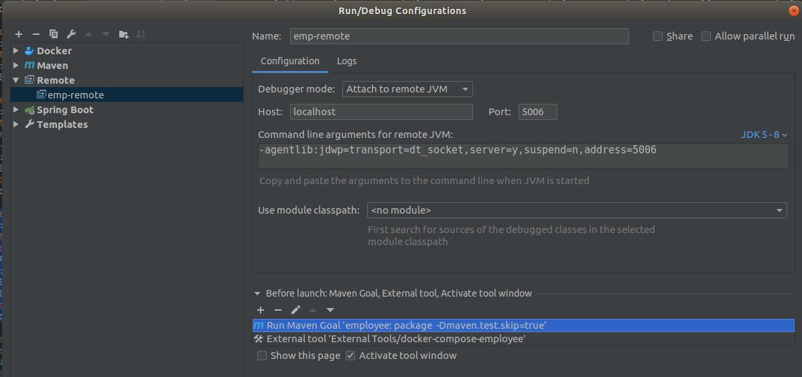

# Microservice-Dockerflow
Reference architecture: Try to research best dev experience of docker flow in dev phase. 
Get all benefit docker bring, avoid the disadvantage of debug.  

- Add smart remote debug configuration to seamless debug in docker container, just like debug normal java process.
- By using jvm built-in support of JAVA_TOOL_OPTIONS options in docker-compose.yaml, so no need to modify dockerfile to support remote debug, use the exact same dockerfile for both production and local environment.

## Run:
Just run docker-compose up, all demo service will be startup.

## Debug:

- By add the below **JAVA_TOOL_OPTIONS** in the docker environment section of the docker-compose.yaml file to support **remote debug in container**.

```
  employee-service:
    build:
      context: ./employee
    environment:
      - JAVA_TOOL_OPTIONS=-agentlib:jdwp=transport=dt_socket,server=y,suspend=n,address=5006
    ports:
      - 9090:9090
      - 5006:5006
    depends_on:
      - config-center
```

- Setup up remote debug in IDE:
By using remote debug configuration, the debug process will automatically run mvn package, re-build docker image and re-create docker instance for the service and then automatically attach to the new container instance for debug.


  1. Set **Before launch** to add mvn package command.
  2. Set **Docker-compose** to run below command in root source directory, e.g. use employee-service as example
  ```
  docker-compose up --build -d --no-deps employee-service
  ```
  3. Update remote debug port to match the exposed port in docker-compose.yaml.

## Notes:
Because of the time factor, **Department**,**Organization** services are not add docker or docker-compose support.

